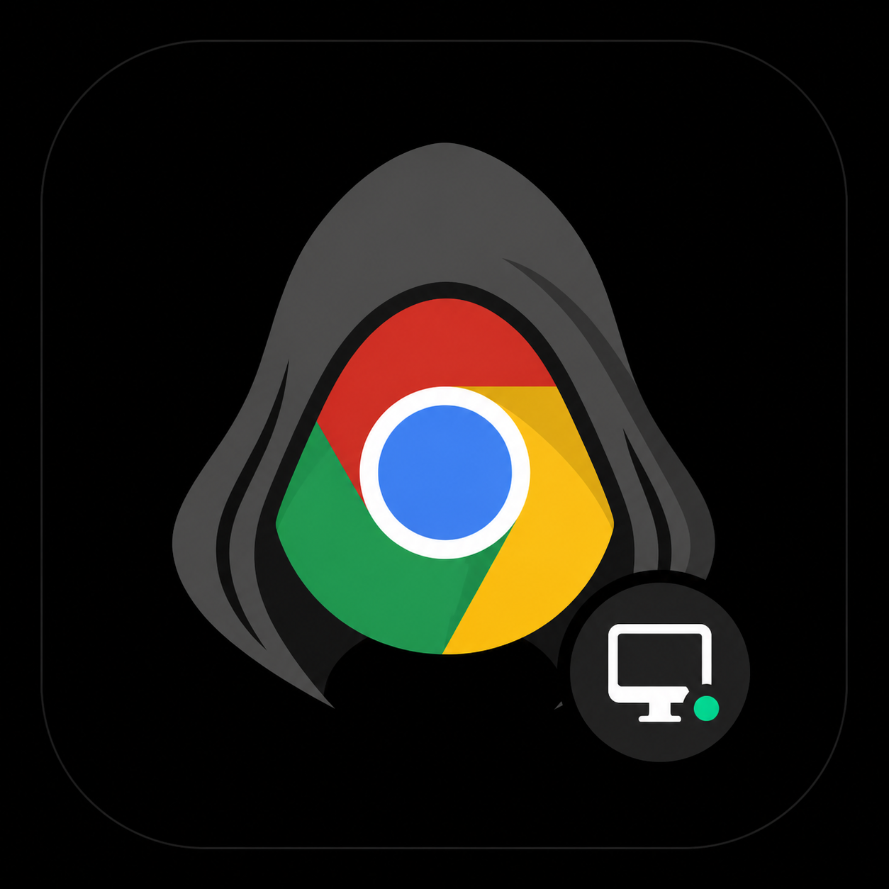

# CloakBrowserDesktop

  

English | [简体中文](./README.md)

CloakBrowserDesktop is a local browser environment manager and launcher powered by [CloakBrowser](https://github.com/CloakHQ/CloakBrowser).

It brings CloakBrowser launches, persistent profiles, fingerprint settings, and proxy capabilities into a desktop management interface. Users can create and maintain multiple isolated browser environments without writing launch scripts.

> The project is designed for individuals and research scenarios that need long-lived, isolated browser environments backed by CloakBrowser.

## Open Source Community

Scan the QR code to join the open source community group, share usage experience, report issues, and discuss contributions.

  

## Overview

| Feature | Description |
|---------|-------------|
| Environment Management | Create, edit, delete, batch start/stop, search and filter |
| Environment Configuration | Proxy, timezone, language, screen size, CPU/memory, fingerprint seed |
| Persistent Data | Cookies, LocalStorage, cache, session state survive across launches |
| Kernel Management | Browse CloakBrowser builds by version with mirror-accelerated downloads |
| Remote Debugging | Auto-allocate CDP port, provide WebSocket address |
| API | Local HTTP API for script and third-party tool integration |
| Proxy Management | Save常用 proxies, reuse when creating environments |
| Multi-language | Chinese and English interface support |

## Details

### Environment Management

Create, edit, delete, batch start/stop, search, and filter browser environments from a unified list.

### Environment Configuration

Each environment uses its own persistent user-data directory, allowing cookies, LocalStorage, cache, and session state to survive browser restarts.

Configurable options include: name, startup URL, proxy, timezone, language, screen size, CPU/memory, storage quota, fingerprint seed, etc.

### Kernel Management

Browse CloakBrowser builds organized by Chromium version with mirror-accelerated downloads. Supports Windows, Linux, and macOS.

### Remote Debugging (CDP)

Automatically allocates a remote debugging port when an environment starts, providing a WebSocket address for direct connection from automation scripts.

### API

Built-in local HTTP API (`http://127.0.0.1:6788`) for controlling environment creation, startup, shutdown, and management via scripts or third-party tools. See the in-app "API" page for details.

## Relationship to CloakBrowser

CloakBrowserDesktop does not modify the CloakBrowser kernel. It provides a visual management and launch layer around those capabilities:

- **CloakBrowser** — browser kernel, fingerprint capabilities, and runtime
- **CloakBrowserDesktop** — environment configuration, profile management, status display, and launch controls

See the [official CloakBrowser project](https://github.com/CloakHQ/CloakBrowser) for detailed capabilities, supported platforms, and kernel releases.

## License

CloakBrowserDesktop is licensed under the [PolyForm Noncommercial License 1.0.0](./LICENSE).

Personal study, research, testing, and other qualifying noncommercial uses are permitted. Commercial use requires separate authorization.
