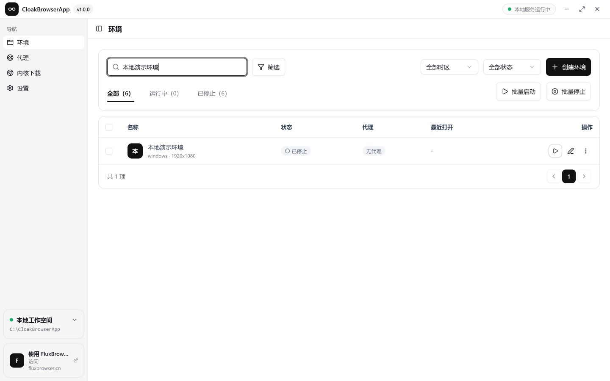
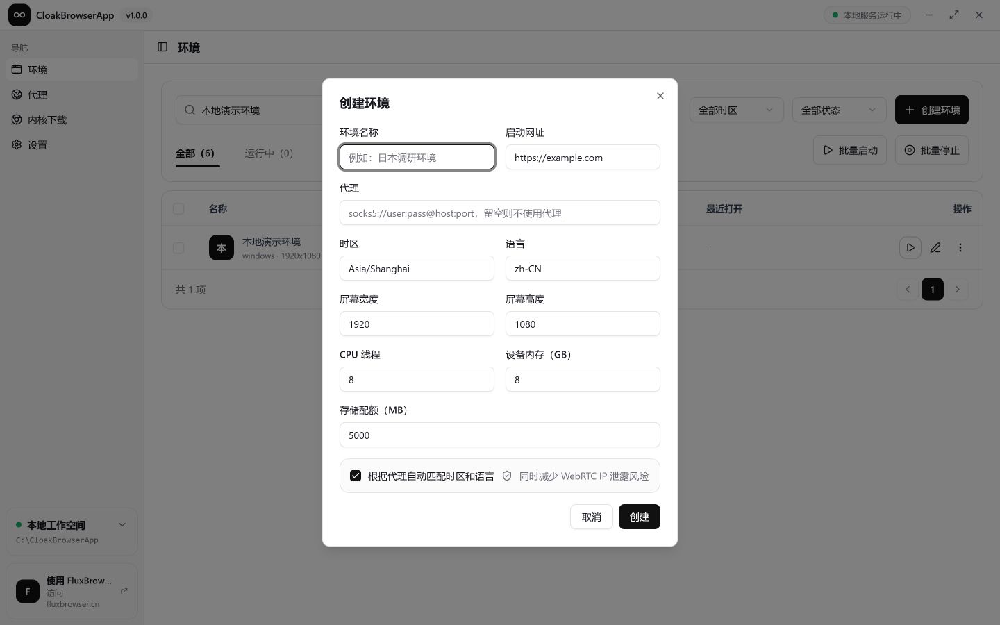
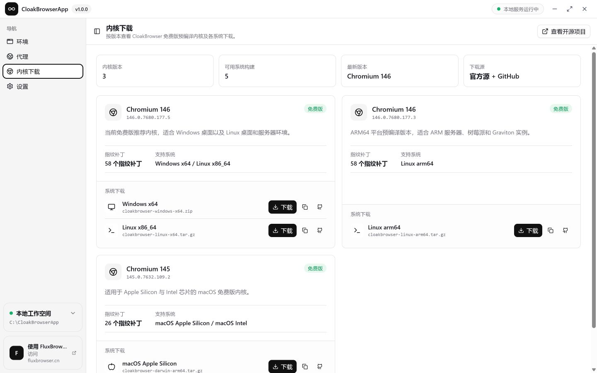

# CloakBrowserApp

English | [简体中文](./README.md)

CloakBrowserApp is a local browser environment manager and launcher powered by [CloakBrowser](https://github.com/CloakHQ/CloakBrowser).

It brings CloakBrowser launches, persistent profiles, fingerprint settings, and proxy capabilities into a desktop management interface. Users can create and maintain multiple isolated browser environments without writing launch scripts.

> The project is designed for individuals and research scenarios that need long-lived, isolated browser environments backed by CloakBrowser.

## Environment Management

The environment list provides one place to inspect and control browser profiles, including runtime status, proxy configuration, and recent activity.

Available management actions include:

- Create, edit, and remove browser environments
- Launch or stop environments individually or in batches
- Search and filter existing environments
- Inspect the current runtime status
- Keep separate browser data for every environment

## Environment Configuration

Each environment uses its own persistent user-data directory, allowing cookies, LocalStorage, cache, and session state to survive browser restarts.

Environment settings include:

- Environment name and startup URL
- HTTP or SOCKS5 proxy
- Timezone and browser locale
- Screen width and height
- CPU threads and device memory
- Browser storage quota
- Automatic timezone and locale matching through the proxy
- CloakBrowser fingerprint seed and launch arguments

When an environment is started, CloakBrowserApp creates the configured persistent browser context and launches a real browser window through CloakBrowser.

## Kernel Management

The kernel page groups available CloakBrowser builds by Chromium version and shows the operating systems supported by each build.

It provides:

- Windows, Linux, and macOS build information
- Official download links
- Download URL copying
- GitHub fallback downloads
- Version, fingerprint patch, and platform details

## Relationship to CloakBrowser

CloakBrowser is a Chromium project with source-level fingerprint modifications and support for persistent profiles, proxies, timezone, locale, and browser fingerprint configuration.

CloakBrowserApp does not modify the CloakBrowser kernel. It provides a visual management and launch layer around those capabilities:

- CloakBrowser supplies the browser kernel, fingerprint capabilities, and browser runtime
- CloakBrowserApp manages environments, profile settings, status, and launch controls

See the [official CloakBrowser project](https://github.com/CloakHQ/CloakBrowser) for detailed browser capabilities, supported platforms, and kernel releases.

## License

CloakBrowserApp is licensed under the [PolyForm Noncommercial License 1.0.0](./LICENSE).

Personal study, research, testing, and other qualifying noncommercial uses are permitted. Commercial use requires separate authorization. CloakBrowser, Chromium, and other third-party components remain subject to their own licenses.
